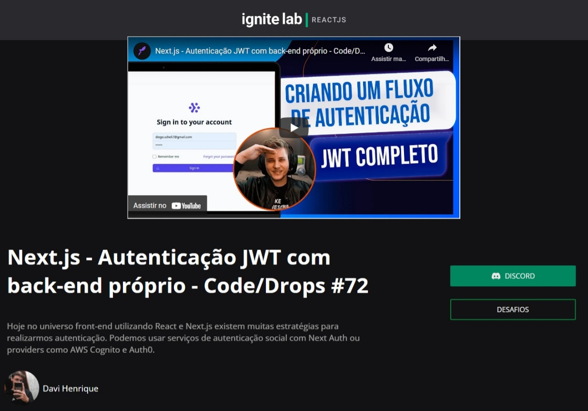

## Events Platforms
Plataforma de Evendo feito no ignite-lab de reacjs com Diego Fernandes.
Modifiquei o projeto para melhorar conhecimento e o objetivo foi consolidar
o conhecimento com Graphql

===

### :computer: Tecnologias:
- Reactjs
- Typescript
- Apollo client
- Graphql
- ReactRouts
### Evento: [Ignite Lab - Reactjs]

===

---
***</>*** **by [Davi Hr](https://github.com/davifa1)**
